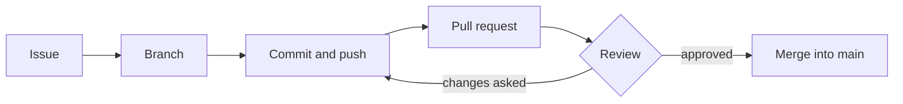

# How a change reaches main

```mermaid
flowchart LR
A[Issue] --> B[Branch]
B --> C[Commit and push]
C --> D[Pull request]
D --> E{Review}
E -- changes asked --> C
E -- approved --> F[Merge into main]
```
